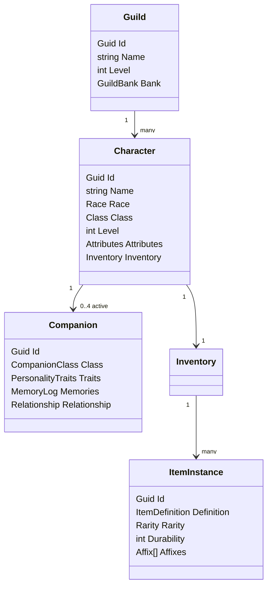
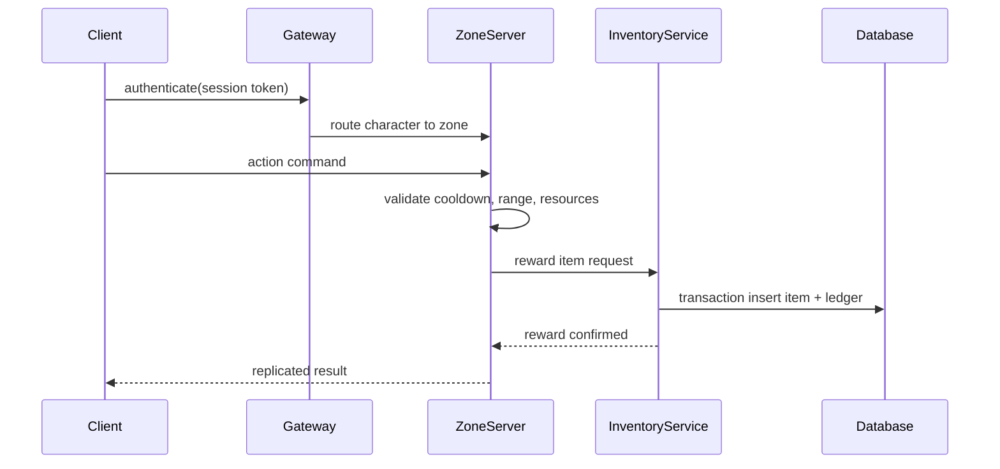

# Aetherfall Online Production Document

## 1. Full Game Design Document

**Title:** Aetherfall Online  
**Genre:** Fantasy MMORPG / real-time action RPG  
**Platform:** PC  
**Engine:** Unity  
**Language:** C#  
**Networking:** Dedicated authoritative servers using Mirror or Unity Netcode for GameObjects  
**Backend:** ASP.NET Core services, PostgreSQL persistence, Redis cache, cloud hosted on Azure or AWS

Aetherfall Online is a shared-world fantasy MMORPG set in Elyndor, a fractured world recovering from the divine catastrophe known as The Sundering. Players explore five major continents, join ideological factions, form parties and guilds, craft evolving legendary equipment, command AI companions, and participate in scalable dungeons, raids, world bosses, trade systems, housing, and territory conflicts.

### Design Pillars

1. **Living World:** Dynamic events, faction control, seasonal arcs, ecology simulation, and persistent player impact.
2. **Deep Progression:** Race, class, specialization, talents, professions, factions, guilds, companions, housing, and legendary item growth.
3. **Action Combat:** Light/heavy attacks, blocking, dodging, parrying, target lock, combos, crowd control, status effects, ultimates, and multi-phase bosses.
4. **Player Economy:** Crafting, contracts, auction house, player shops, guild commerce, dynamic prices, and regional supply constraints.
5. **AI Companions:** Personality traits, memory, loyalty, relationships, class/profession trees, emotional state, tactical decisions, and synergies.
6. **Commercial Scalability:** Clean architecture, ScriptableObject data, dependency injection, dedicated server authority, telemetry, anti-cheat, and content pipelines.

### Core Player Loop

Explore zone -> complete quests/events -> gather resources -> fight enemies/bosses -> earn loot/currency/reputation -> craft/enchant/upgrade gear -> improve class, faction, companion, guild, and profession progression -> unlock harder dungeons, raids, territory objectives, and legendary hunts.

### Content Cadence

- Weekly rotating contracts, world events, and economy modifiers.
- Monthly dungeon affixes and faction campaigns.
- Quarterly raid wings, guild projects, and legendary hunts.
- Annual continent-scale expansion chapters.

## 2. Complete World Lore

Elyndor was shaped by immortal beings called the Aetherlords, entities who bent magic, matter, memory, and time through Aether Wells. Their rule was beautiful and oppressive: cities floated above mortal kingdoms while mortals paid tribute in labor, worship, and dreams. The rebellion that followed ended in The Sundering, a cataclysm that shattered ley lines, drowned empires, birthed monsters, and scattered divine artifacts.

Modern Elyndor is rebuilding. Human Valoria seeks political unity, Sylthar preserves elven arcane forests, Khaz'Gar guards dwarven mountain vaults, Umbrath survives through shadow pacts, and Drak'Thor tempers dragonborn honor in volcanic forges. Ancient seals are failing. The lost Aetherlord Vael'Tharis whispers through relics, promising restoration at the cost of mortal freedom.

### Pantheon

| Deity | Domain | Worshippers | Conflict |
| --- | --- | --- | --- |
| Aurelion, Dawnfather | Light, courage, lawful oaths | Order of Dawn, paladins | Opposes necromancy and shadow pacts |
| Myr, the Verdant Dream | Nature, growth, memory | Elves, rangers, healers | Fears industrial overreach |
| Korvax Emberhand | Forge, endurance, craft | Dwarves, artificers, smiths | Distrusts dragons and greed |
| Selunea Veilborne | Moon, secrets, mercy | Spies, bards, dark elves | Hides forbidden truths |
| Tharos the Red Scale | War, dragons, ambition | Dragonborn, warriors | Tests mortals through conflict |
| Eshara the Last Whisper | Death, transition, lost souls | Necromancers, mourners | Condemns soul enslavement |

### Kingdoms and Political Systems

- **Valoria:** Constitutional monarchy with noble houses, elected city burgomasters, and a royal war council.
- **Sylthar:** Elven archon circles where ancient mages and grove speakers must reach consensus.
- **Khaz'Gar:** Clan empire led by a High Thane chosen by forge trials and clan votes.
- **Umbrath:** Matriarchal city-states ruled by shadow courts, trade secrets, and binding contracts.
- **Drak'Thor:** Dragonborn forgeholds governed by honor duels, elder councils, and oath ledgers.

### Religions

- **Dawn Orthodoxy:** Public temples, healing rites, oath magic, and anti-undead crusades.
- **Verdant Communion:** Sacred groves, ancestral memory rituals, and seasonal pilgrimages.
- **Ember Covenant:** Craft as worship, masterwork offerings, and forge funerals.
- **Veiled Path:** Confession through secrets, moonlit mercy, and hidden sanctuary networks.
- **Scale Rite:** Dragonborn trials of strength, leadership, and controlled fury.
- **Silent Passage:** Funerary guardians who protect souls from binding and corruption.

### Major Guilds

Adventurers' Charter, Cartographers' League, Free Crafters' Compact, Silver Quill Chroniclers, Beastwardens, Runic Surveyors, Mercenary Exchange, and Hearthbuilders' Union.

### Monster Ecology

- **Aetherborn:** Ley-mutated beasts drawn to mana storms.
- **Sundered:** Broken constructs and spirits from ruined Aetherlord cities.
- **Blightkin:** Corrupted flora and fauna spreading from cracked Aether Wells.
- **Drakes:** Territorial predators nesting near volcanic and crystal-rich regions.
- **Deepkin:** Subterranean threats awakened by dwarven mining.
- **Wraith Courts:** Organized undead societies bound to failed ancient oaths.

### Legendary Artifacts

- **Crown of the First Oath:** Unifies armies but amplifies bearer pride.
- **Verdant Starseed:** Restores dead forests or creates uncontrollable growth.
- **Hammer of Korvax:** Forges mythic items from impossible materials.
- **Veilknife:** Cuts memory, shadow, and dimensional seams.
- **Ashscale Aegis:** Shield born from a dragon's final vow.
- **Sundering Shard:** Fragment of the original cataclysm; required by Vael'Tharis.

## 3. Historical Timeline

| Era | Years | Key Events |
| --- | --- | --- |
| Primordial Aether | -10000 to -7000 | Aether Wells ignite; Aetherlords manifest; first mortal tribes form. |
| Crowned Sky | -7000 to -3500 | Floating cities rise; divine tribute systems begin; pantheon cults split. |
| Mortal Compact | -3500 to -2500 | Humans, elves, dwarves, orcs, dragonborn, and dark elves form the first rebellion. |
| The Sundering | -2500 | Aetherlord war tears ley lines apart; continents divide; monsters mutate. |
| Ashen Centuries | -2500 to -1200 | Famine, migration, and monster invasions; first modern kingdoms form. |
| Reclamation | -1200 to -300 | Guilds, temples, and trade routes rebuild civilization. |
| Age of Banners | -300 to 0 | Factions rise; raids rediscover sealed ruins; Vael'Tharis stirs. |
| Aetherfall Present | 0 | Players become newly awakened Aetherbound capable of resisting ancient influence. |

## 4. Main Story

### Act I: Ashes Remember
Players begin in race-specific regions during localized crises caused by unstable Aether Wells. They learn they are Aetherbound: mortals capable of absorbing and purifying Sundering energy.

### Act II: Five Crowns, One Wound
Players travel across all continents to recover seal fragments. Each kingdom demands concessions, creating faction reputation choices and branching political consequences.

### Act III: The Aetherlord's Bargain
Vael'Tharis offers power to restore the world by reestablishing divine rule. Players choose to destroy, bind, redeem, or partially release the Aetherlord.

### Endings
- **Mortal Dawn:** Destroy Vael'Tharis; factions gain independence but ley instability remains.
- **Bound Crown:** Imprison Vael'Tharis in a guild-built seal; requires server-wide crafting projects.
- **Restored Empire:** Accept controlled Aetherlord assistance; short-term prosperity with authoritarian risks.
- **Shattered Choice:** Fail to unite factions; world enters darker seasonal arcs.

## 5. Character Systems

### Playable Races

| Race | Lore | Traits | Passive Bonuses | Customization | Starting Zone |
| --- | --- | --- | --- | --- | --- |
| Human | Adaptive heirs of Valoria's fractured courts. | Versatile, diplomatic | +2% reputation gain, +1 talent point every 20 levels | body, ancestry, noble/common marks, scars | Valorian Marches |
| Elf | Long-lived stewards of Sylthar's living cities. | Arcane, graceful | +3% mana regen, +2% nature resistance | ears, luminous tattoos, hair vines, eye glow | Sylthar Canopy |
| Dark Elf | Survivors of Umbrath's shadow refuge. | Stealth, intrigue | +3% shadow resistance, +2% critical damage from stealth | ash skin, eye flame, house sigils | Umbral Spires |
| Dwarf | Clan-bound masters of Khaz'Gar stone and forge. | Durable, industrious | +4% durability, +5 crafting skill when refining metals | beards, clan brands, prosthetics | Ironroot Hold |
| Orc | Nomadic oath-clans seeking honor after exile. | Ferocity, endurance | +3% stamina, +2% crowd-control resistance | tusks, warpaint, trophies | Redstep Barrens |
| Dragonborn | Volcanic forgeborn descendants of ancient drakes. | Elemental, honorable | +3% fire resistance, breath racial cooldown | scales, horns, crest, ember glow | Drak'Thor Caldera |

### Attributes

| Attribute | Primary Effects |
| --- | --- |
| Strength | melee damage, block stability, heavy armor scaling |
| Dexterity | attack speed, dodge distance, ranged damage, crit chance |
| Intelligence | spell power, mana pool, summon effectiveness |
| Vitality | health, physical resistance, stamina recovery |
| Wisdom | healing, cooldown recovery, mana regen, companion command efficiency |
| Luck | drop quality, critical crafting, proc chance, rare event discovery |

#### Scaling Formulas

- Health = `100 + Level * 18 + Vitality * 12`
- Mana = `50 + Level * 8 + Intelligence * 8 + Wisdom * 4`
- Stamina = `75 + Level * 6 + Dexterity * 3 + Vitality * 5`
- PhysicalDamage = `WeaponDamage * (1 + Strength * 0.006 + Dexterity * 0.002)`
- SpellDamage = `SpellPower * (1 + Intelligence * 0.007 + Wisdom * 0.002)`
- Healing = `BaseHeal * (1 + Wisdom * 0.007 + Intelligence * 0.002)`
- CriticalChance = `min(0.5, BaseCrit + Dexterity * 0.0008 + Luck * 0.0006)`

#### Caps and Interactions

Soft cap at 250 rating per attribute, hard cap at 400 before temporary buffs. Past soft cap, each point gives 50% of normal value. Strength and Vitality improve guard break resistance; Intelligence and Wisdom improve ultimate generation; Dexterity and Luck improve combo finishers and crafting discovery.

## 6. Class Designs

| Class | Role | Playstyle | Specializations | Ultimate Examples |
| --- | --- | --- | --- | --- |
| Warrior | Tank / bruiser | weapon combos, blocks, taunts | Guardian, Berserker, Warlord | Titan Breaker, Unyielding Banner |
| Mage | Ranged DPS / control | elemental rotations and area denial | Pyromancer, Cryomancer, Arcanist | Celestial Meteor, Time Fracture |
| Rogue | Melee DPS / utility | stealth, poisons, burst windows | Assassin, Trickster, Shadowblade | Death Mark, Vanishing Storm |
| Ranger | Ranged DPS / support | bows, traps, beasts, mobility | Marksman, Beastmaster, Pathfinder | Skyfall Volley, Apex Predator |
| Paladin | Tank / healer | holy shields, auras, judgments | Templar, Dawnkeeper, Inquisitor | Radiant Crusade, Divine Bastion |
| Necromancer | DPS / summons | curses, undead minions, soul spenders | Bonelord, Cursemaster, Soulbinder | Army of the Veil, Soul Eclipse |
| Bard | Support / control | songs, rhythm combos, morale buffs | Virtuoso, Skald, Mesmer | Anthem of Legends, Encore of Fate |
| Summoner | Pet DPS / utility | elemental and spirit companions | Eidolist, Primalist, Pactbinder | Grand Convergence, Avatar Gate |
| Artificer | Hybrid / engineer | turrets, gadgets, runic tech | Machinist, Alchemical Savant, Runegunner | Clockwork Colossus, Singularity Engine |

### Ability Structure

Each class owns: 3 basic attacks, 5 core abilities, 3 mobility/defense tools, 2 resource spenders, 2 utility skills, 1 class ultimate, 3 specialization ultimates, and a level 1-100 talent tree.

### Progression Path

- Levels 1-10: class identity and basic kit.
- Levels 11-30: first specialization and dungeon role training.
- Levels 31-60: talent branches, ultimate modifiers, faction skill variants.
- Levels 61-100: mastery nodes, legendary class quests, raid set bonuses.

## 7. Skill Trees

Skill trees use three branches per class. Nodes cost class talent points and include active abilities, passive modifiers, combo extenders, ultimate augments, and role-defining keystones.

Example Warrior tree:

- **Guardian:** Shield Wall, Taunting Roar, Bastion Stance, Intercept, Keystone: Aegis Unbroken.
- **Berserker:** Blood Momentum, Cleaving Fury, Reckless Leap, Execute, Keystone: Rage Eternal.
- **Warlord:** Commanding Shout, Rally Formation, Banner Slam, Tactical Advance, Keystone: Field Commander.

Each class follows the same structure: 5 tiers, 8 minor nodes, 4 major nodes, 1 capstone per branch, and cross-branch synergy gates at levels 40, 70, and 100.

## 8. Combat Design

Combat is real-time, server-authoritative, animation-driven, and readable in group encounters.

### Player Actions

- **Light Attack:** fast resource builder; chains into three-hit combos.
- **Heavy Attack:** slower guard-break or armor-piercing strike.
- **Block:** cone-based mitigation using stamina.
- **Dodge:** short invulnerability window with stamina cost.
- **Parry:** timed counter that staggers vulnerable enemies.
- **Combos:** ordered inputs and status primers/detonators.
- **Target Lock:** soft lock for controllers and ranged precision.
- **Ultimates:** generated by damage, support actions, mechanics, and tactical play.

### Status Effects

| Effect | Gameplay |
| --- | --- |
| Burning | damage over time, spreads with oil/wind interactions |
| Frozen | slow, then root or shatter when struck by heavy attacks |
| Poisoned | healing reduction and ramping nature damage |
| Bleeding | physical damage over time, stronger while moving |
| Shocked | chain damage and interrupt vulnerability |
| Cursed | reduced resistances and curse-specific triggers |

### Boss Design

Bosses support multi-phase behavior, arena hazards, add waves, group soak mechanics, split-party tasks, enrage timers, and role checks. Raid bosses expose telegraphs to clients but resolve hits server-side. Enrage triggers after time, failed mechanics, or excessive deaths.

## 9. Crafting Design

Professions: Blacksmithing, Tailoring, Alchemy, Jewelcrafting, Enchanting, Runecrafting. Gathering resources include Ore, Wood, Herbs, Leather, Crystals, Gems, Monster Parts, Magical Essence, and Runestones.

### Progression Ranks

| Rank | Skill |
| --- | --- |
| Novice | 1-25 |
| Apprentice | 26-50 |
| Journeyman | 51-100 |
| Expert | 101-150 |
| Master | 151-200 |
| Grandmaster | 201-300 |

Higher ranks improve quality, speed, material efficiency, recipe access, and success rates. Players discover recipes through experimentation, trainers, dismantling rare items, faction vendors, raids, guild projects, and world events.

### Specializations

- **Blacksmith:** Weaponsmith, Armorsmith, Runeforger.
- **Alchemy:** Potion Master, Poison Master, Elixir Master.
- **Enchanting:** Elementalist, Soulbinder, Arcane Weaver.

### Item Quality Formula

`QualityScore = CraftingSkill * 0.40 + MaterialQuality * 0.25 + SpecializationBonus * 0.15 + StationQuality * 0.10 + RandomRoll * 0.10`

Tiers: Common, Uncommon, Rare, Epic, Legendary, Mythic. Quality affects damage, durability, appearance, value, sockets, upgrade potential, and affix budget.

### Critical Crafting

| Skill | Critical Chance |
| --- | --- |
| 25 | 1% |
| 100 | 5% |
| 200 | 10% |
| 300 | 20% |

Critical results can improve rarity, add sockets, grant bonus stats, roll unique affixes, or create unique item names.

## 10. Enchanting Design

Enchantable categories: Weapons, Armor, Accessories. Materials: Soul Gems, Arcane Dust, Mana Crystals, Ancient Relics, and Runestones.

Effects include Fire, Frost, Lightning, Poison Damage, Lifesteal, Mana Regen, Health Regen, Critical Chance, Defense, Magic Resistance, Movement Speed, and Experience Gain. Enchantments have power budgets, compatibility tags, risk levels, and overwrite or infusion rules. Soulbinder enchanters can attach companion memories to items for conditional bonuses.

## 11. Runecrafting Design

Runecrafting creates modular rune effects and combinations.

| Rune | Theme | Base Effects |
| --- | --- | --- |
| Ember Rune | fire, fury | burning, forge quality, burst damage |
| Storm Rune | lightning, speed | chain damage, haste, interrupts |
| Frost Rune | control, defense | slows, shields, durability |
| Void Rune | shadow, sacrifice | curses, lifesteal, stealth |
| Ascendant Rune | aether, evolution | scaling, ultimate gain, mythic recipes |

Systems include rune creation, fusion, upgrading, socketing, extraction, and secret combinations discovered through world clues.

## 12. Economy Design

Aetherfall uses regional markets with global search, taxes, and resource scarcity.

- **Auction House:** buyouts, bids, category filters, price history, anti-manipulation limits.
- **Trading:** secure player-to-player exchange with confirmation locks.
- **Crafting Contracts:** request item, quality, deadline, escrow, collateral, and rating.
- **Guild Commerce:** guild stores, workshop fees, project orders, internal ledgers.
- **Dynamic Pricing:** vendor prices react to supply, faction control, world events, and server age.
- **Player Shops:** housing storefronts with rent, signage, NPC vendors, and commission boards.
- **Apprentices:** NPC or player apprentices accelerate basic crafting and gathering tasks with caps.

Currency sinks: repairs, housing upkeep, auction taxes, travel, transmog, guild projects, crafting station upgrades, and legendary item evolution.

## 13. Guild Design

Guilds provide social progression and endgame coordination.

- Levels 1-50 with perks unlocked by activity, achievements, and projects.
- Guild housing, workshops, banks, ranks, permissions, audit logs, and treasury.
- Guild crafting projects for siege engines, raid keys, legendary forges, and housing upgrades.
- Guild raids and rankings by seasonal performance, crafting prestige, territory control, and world boss contribution.
- Governance options: leader, council, democratic votes, officer-managed departments.

## 14. Housing Design

Housing types: Homes, Farms, Workshops, Estates, Castles.

Benefits include storage, crafting stations, rested experience, fast travel, vendor NPCs, companion housing, trophies, farm plots, contract boards, and guild meeting spaces. Estates and castles can host workshops, defensive events, seasonal decor, and public shops.

## 15. Companion Design

Players may field up to 4 active companions. Companions have class, level, equipment, personality, memory, loyalty, relationship rank, profession, and storylines.

Companion classes: Warrior, Mage, Rogue, Ranger, Healer, Necromancer, Bard, Summoner, Artificer.

Personality traits range 0-100: Loyalty, Courage, Compassion, Greed, Aggression, Curiosity, Discipline, Humor, Ambition, Wisdom. Traits influence dialogue, combat risk, quest choices, loot preferences, party banter, and AI utility scoring.

### Relationship Ranks

Stranger, Companion, Trusted Ally, Best Friend, Soulbound Ally. Benefits include passive bonuses, team attacks, better AI coordination, unique quests, personal crafting bonuses, and exclusive endings.

### Companion Progression

Level cap 100 with five trees: Class, Personality, Profession, Relationship, Legendary. Companion profession trees include Blacksmith, Alchemist, Enchanter, and Runecrafter.

## 16. Companion AI Architecture

Companion AI combines behavior trees, utility AI, finite state machines, emotional systems, and relationship systems.

### Decision Inputs

Threat level, health/mana/stamina, player commands, enemy roles, terrain, status effects, personality, relationship trust, recent memories, tactical opportunities, current quest context, and party composition.

### AI Layers

1. **Perception:** server-authoritative awareness and local prediction for responsiveness.
2. **Blackboard:** shared tactical facts and memory references.
3. **Utility Scoring:** ranks actions by survival, damage, healing, control, loyalty, courage, and opportunity.
4. **Behavior Tree:** executes chosen high-level tactic.
5. **State Machine:** controls animation-safe states such as Idle, Follow, Engage, Retreat, Revive, Interact.
6. **Emotion Model:** modifies thresholds based on fear, trust, anger, and morale.
7. **Memory Resolver:** records significant events and exposes them to dialogue and loyalty systems.

## 17. Companion Relationships

Companions remember player choices, quests, rescues, betrayals, faction decisions, and story outcomes. Memories have type, emotional valence, decay, importance, involved actors, and gameplay tags. Trust, loyalty, romance, friendships, and rivalries are derived from memory aggregates and direct relationship events.

Example impacts:

- Repeated mercy increases Compassion-aligned loyalty.
- Betraying a faction may alienate disciplined or loyal companions.
- Rescuing a companion unlocks Best Friend quests.
- Soulbound Ally requires personal legendary quest completion.

## 18. Companion Synergy Design

### Pair Synergies

| Pair | Skill | Theme |
| --- | --- | --- |
| Warrior + Mage | Arcane Shockwave | shield slam detonates spell charge |
| Warrior + Healer | Guardian Oath | damage redirection and burst heal |
| Mage + Rogue | Shadow Nova | stealth strike triggers arcane explosion |
| Ranger + Beastmaster | Pack Hunt | coordinated pet and ranged assault |
| Necromancer + Mage | Soul Storm | curse field with elemental strikes |

### Group Synergies

- Warrior + Mage + Healer: Heroes of Light.
- Warrior + Rogue + Ranger: Hunter Assault Team.
- Mage + Necromancer + Healer: Mystic Trinity.
- Warrior + Rogue + Mage: Legendary Adventurers.

### Crafting Synergies

- Blacksmith + Enchanter: +15% enchantment strength.
- Alchemist + Ranger: +25% ingredient yield.
- Runecrafter + Mage: +20% rune effectiveness.
- Master Artisan Team: Blacksmith + Enchanter + Runecrafter + Alchemist for better quality, legendary chance, and efficiency.

Synergy ranks: Novice, Cooperative, Coordinated, Elite, Legendary Partnership. Each rank unlocks new attacks, reduced cooldowns, AI teamwork bonuses, and exclusive dialogue.

## 19. Multiplayer Architecture

Aetherfall uses dedicated authoritative zone servers, instance servers, and backend services.

### Runtime Topology

- **Gateway:** authentication handoff, routing, rate limits, and session tokens.
- **World Service:** character location, shard selection, presence, matchmaking.
- **Zone Servers:** open-world simulation, NPCs, events, combat authority.
- **Instance Servers:** dungeons, raids, housing interiors, solo story phases.
- **Chat Service:** channels, moderation, guild chat, proximity chat.
- **Economy Service:** auction house, contracts, trade settlement.
- **Guild Service:** roster, permissions, projects, banks, rankings.
- **Inventory Service:** item ownership, durability, bank, mail, anti-duplication.
- **Telemetry Service:** metrics, cheat signals, balance data.

Party size supports 2-8 players. Raid sizes support 5, 10, and 20 players. Shared events and world bosses scale by participant count and average item power.

## 20. Database Schema

PostgreSQL schema uses UUID primary keys, optimistic concurrency versions, audit timestamps, and append-only ledgers for economy-critical flows.

```sql
CREATE TABLE accounts (
    id UUID PRIMARY KEY,
    email_hash TEXT NOT NULL UNIQUE,
    created_at TIMESTAMPTZ NOT NULL,
    last_login_at TIMESTAMPTZ
);

CREATE TABLE characters (
    id UUID PRIMARY KEY,
    account_id UUID NOT NULL REFERENCES accounts(id),
    name TEXT NOT NULL UNIQUE,
    race TEXT NOT NULL,
    class TEXT NOT NULL,
    level INT NOT NULL DEFAULT 1,
    experience BIGINT NOT NULL DEFAULT 0,
    continent TEXT NOT NULL,
    zone TEXT NOT NULL,
    position JSONB NOT NULL,
    attributes JSONB NOT NULL,
    version BIGINT NOT NULL DEFAULT 0
);

CREATE TABLE items (
    id UUID PRIMARY KEY,
    owner_character_id UUID REFERENCES characters(id),
    template_id TEXT NOT NULL,
    rarity TEXT NOT NULL,
    durability INT NOT NULL,
    affixes JSONB NOT NULL,
    sockets JSONB NOT NULL,
    bound_state TEXT NOT NULL,
    version BIGINT NOT NULL DEFAULT 0
);

CREATE TABLE inventories (
    character_id UUID PRIMARY KEY REFERENCES characters(id),
    slots JSONB NOT NULL,
    weight_used NUMERIC NOT NULL,
    gold BIGINT NOT NULL DEFAULT 0,
    version BIGINT NOT NULL DEFAULT 0
);

CREATE TABLE quests (
    character_id UUID NOT NULL REFERENCES characters(id),
    quest_id TEXT NOT NULL,
    state TEXT NOT NULL,
    progress JSONB NOT NULL,
    choices JSONB NOT NULL,
    PRIMARY KEY (character_id, quest_id)
);

CREATE TABLE faction_reputation (
    character_id UUID NOT NULL REFERENCES characters(id),
    faction_id TEXT NOT NULL,
    reputation INT NOT NULL,
    rank TEXT NOT NULL,
    PRIMARY KEY (character_id, faction_id)
);

CREATE TABLE companions (
    id UUID PRIMARY KEY,
    character_id UUID NOT NULL REFERENCES characters(id),
    companion_template_id TEXT NOT NULL,
    level INT NOT NULL,
    loyalty INT NOT NULL,
    traits JSONB NOT NULL,
    memories JSONB NOT NULL,
    skill_trees JSONB NOT NULL
);

CREATE TABLE guilds (
    id UUID PRIMARY KEY,
    name TEXT NOT NULL UNIQUE,
    level INT NOT NULL DEFAULT 1,
    treasury BIGINT NOT NULL DEFAULT 0,
    settings JSONB NOT NULL
);

CREATE TABLE guild_members (
    guild_id UUID NOT NULL REFERENCES guilds(id),
    character_id UUID NOT NULL REFERENCES characters(id),
    rank TEXT NOT NULL,
    permissions JSONB NOT NULL,
    PRIMARY KEY (guild_id, character_id)
);

CREATE TABLE auction_listings (
    id UUID PRIMARY KEY,
    seller_character_id UUID NOT NULL REFERENCES characters(id),
    item_id UUID NOT NULL REFERENCES items(id),
    buyout_price BIGINT,
    bid_price BIGINT,
    expires_at TIMESTAMPTZ NOT NULL,
    status TEXT NOT NULL
);

CREATE TABLE economy_ledger (
    id UUID PRIMARY KEY,
    actor_character_id UUID REFERENCES characters(id),
    event_type TEXT NOT NULL,
    amount BIGINT NOT NULL,
    metadata JSONB NOT NULL,
    created_at TIMESTAMPTZ NOT NULL
);
```

## 21. UML Diagrams

### Core Domain



### Server Flow



## 22. Folder Structure

```text
Assets/
  Aetherfall/
    Art/
    Audio/
    Prefabs/
    Scenes/
    ScriptableObjects/
      Abilities/
      Classes/
      Companions/
      Crafting/
      Factions/
      Items/
      Quests/
      Races/
      StatusEffects/
      Zones/
    Scripts/
      Client/
      Shared/
        Application/
        Domain/
        Infrastructure/
        Presentation/
      Server/
        Combat/
        Economy/
        Guilds/
        Inventory/
        Persistence/
        Quests/
        World/
      Tests/
Server/
  Aetherfall.Api/
  Aetherfall.Gateway/
  Aetherfall.Services.Economy/
  Aetherfall.Services.Guilds/
  Aetherfall.Services.Inventory/
  Aetherfall.Services.World/
  Aetherfall.Shared/
```

## 23. ScriptableObject Definitions

```csharp
public abstract class AetherfallDefinition : ScriptableObject
{
    public string Id;
    public string DisplayName;
    [TextArea] public string Description;
}

[CreateAssetMenu(menuName = "Aetherfall/Character/Class")]
public sealed class ClassDefinition : AetherfallDefinition
{
    public Role PrimaryRole;
    public AbilityDefinition[] StartingAbilities;
    public SpecializationDefinition[] Specializations;
    public TalentTreeDefinition TalentTree;
}

[CreateAssetMenu(menuName = "Aetherfall/Combat/Ability")]
public sealed class AbilityDefinition : AetherfallDefinition
{
    public float CooldownSeconds;
    public float ResourceCost;
    public TargetingMode TargetingMode;
    public EffectDefinition[] Effects;
    public StatusEffectDefinition[] AppliedStatusEffects;
}

[CreateAssetMenu(menuName = "Aetherfall/Items/Item")]
public sealed class ItemDefinition : AetherfallDefinition
{
    public ItemCategory Category;
    public EquipmentSlot Slot;
    public Rarity MinimumRarity;
    public StatModifier[] BaseStats;
    public SocketRule SocketRule;
}

[CreateAssetMenu(menuName = "Aetherfall/Companion/Companion")]
public sealed class CompanionDefinition : AetherfallDefinition
{
    public CompanionClass Class;
    public PersonalityTraits BaseTraits;
    public TalentTreeDefinition ClassTree;
    public QuestDefinition[] PersonalQuests;
}
```

ScriptableObjects are immutable runtime definitions. Player state stores only IDs, rolled values, and progression; services resolve definitions through injected repositories.

## 24. Save System Design

Client saves only settings, graphics, keybinds, accessibility options, cached manifests, and safe UI layout data. All gameplay state is server authoritative. Backend services persist through transactional repositories, event ledgers, version columns, and periodic snapshots. Recovery uses last known consistent snapshot plus replayable ledger events for economy and inventory.

## 25. Production-Ready C# Architecture

Use Clean Architecture boundaries:

- **Domain:** entities, value objects, combat formulas, crafting rules, quest state machines.
- **Application:** use cases, commands, validators, interfaces, DTOs.
- **Infrastructure:** PostgreSQL repositories, Redis, cloud queues, telemetry, auth integrations.
- **Presentation:** Unity client controllers, server hubs, ASP.NET Core endpoints.

Principles:

- SOLID, dependency injection, async persistence, deterministic combat simulation, idempotent backend commands, input validation, server authority, testable pure formulas, and content data validation.
- Avoid singletons except composition roots and Unity bootstrap adapters.
- Use event-driven systems for combat, quest updates, inventory changes, crafting completion, faction reputation, and companion memories.

Example application command:

```csharp
public sealed record CraftItemCommand(
    Guid CharacterId,
    string RecipeId,
    IReadOnlyList<Guid> MaterialItemIds,
    string StationId);

public interface ICraftingService
{
    Task<CraftItemResult> CraftAsync(CraftItemCommand command, CancellationToken cancellationToken);
}
```

## 26. Server Architecture

Dedicated servers run authoritative simulation ticks. Clients submit intent, never final results. Servers validate movement, cooldowns, resources, line of sight, target legality, inventory ownership, and encounter state before replication.

### Services

- ASP.NET Core account, character, guild, economy, and inventory APIs.
- Realtime zone/instance processes for combat and world state.
- PostgreSQL for persistence, Redis for ephemeral locks and matchmaking, object storage for logs and content manifests.
- Message bus for economy settlements, mail, guild notifications, telemetry, and seasonal jobs.

### Scaling

Shard by region and zone. Dynamic instance allocation for dungeons, raids, and housing. World bosses run on reserved zone workers. Guild wars reserve territory simulation nodes.

## 27. Anti-Cheat Design

- Server authority for combat, movement reconciliation, loot, crafting, trade, and currency.
- Rate limits and sanity checks for movement speed, attack cadence, cooldowns, resource spend, and packet frequency.
- Inventory/economy ledgers with replay detection, item versioning, trade locks, and duplicate detection.
- Telemetry anomaly detection for farming routes, auction manipulation, impossible DPS, invalid boss clears, and scripted inputs.
- Client integrity checks, obfuscation for sensitive client logic, ban waves, appeal logs, and GM tools.

## 28. Endgame Systems

- **Mythic Dungeons:** rotating affixes, timed rewards, leaderboards, upgrade currency.
- **World Bosses:** server-wide events, faction objectives, legendary materials.
- **Guild Wars:** territory capture, siege crafting, seasonal rankings.
- **Legendary Hunts:** multi-step clue chains culminating in elite targets.
- **Territory Control:** faction and guild influence alters vendors, taxes, guards, and events.
- **Seasonal Content:** battle-pass-free seasonal journeys with cosmetics, titles, recipes, and story chapters.
- **Legendary Crafting:** Grandmaster professions, boss materials, legendary forges, guild projects, evolving items that scale with player level and unlock powers through use.

## 29. Expansion Roadmap

| Release | Focus | Highlights |
| --- | --- | --- |
| Launch | Elyndor Core | 5 continents, 6 races, 9 classes, level 100, 8 dungeons, 3 raids, housing, guilds, crafting, companions |
| Season 1 | The Broken Seal | world boss chain, first guild war season, new legendary hunts |
| Season 2 | Courts of Umbrath | shadow city campaign, rogue/bard updates, secret rune combinations |
| Season 3 | Ember Below | dwarven deep roads, raid wing, legendary forge projects |
| Expansion 1 | Isles of the Aether Sea | naval travel, island housing, new profession, 2 classes/specs |
| Expansion 2 | Return of the Sky Cities | aerial zones, Aetherlord raids, expanded companion romance and rivalry arcs |

## 30. Full Production Plan

### Team Structure

- Game Director and Product Owner.
- Design: systems, combat, economy, narrative, encounter, level, UX.
- Engineering: Unity client, gameplay, backend, tools, DevOps, QA automation, security.
- Art: concept, character, environment, VFX, animation, technical art, UI.
- Audio: music, SFX, voice pipeline.
- QA: embedded feature QA, automation, compatibility, live operations.
- Live Ops: community, support, analytics, economy management, content scheduling.

### Milestones

| Milestone | Duration | Deliverables |
| --- | --- | --- |
| Preproduction | 6 months | playable combat prototype, world bible, network spike, vertical slice plan |
| Vertical Slice | 6 months | one zone, two classes, dungeon, crafting loop, companion prototype, backend account flow |
| Alpha | 12 months | all core systems, five continents blockout, guilds, economy, first raid, automation |
| Beta | 6 months | content complete, balance passes, server scale tests, anti-cheat hardening, localization |
| Launch Prep | 3 months | certification, operations drills, marketing beats, support tooling, final tuning |
| Live | ongoing | seasons, expansions, balance, events, security patches, economy interventions |

### Validation Strategy

- Unit tests for formulas, crafting quality, item transactions, quest state transitions, and companion utility scoring.
- Integration tests for inventory/economy transactions, guild permissions, auctions, and persistence.
- Load tests for login, zone population, world boss events, auction searches, and raid instances.
- Playtests for combat readability, class identity, onboarding, crafting economy, and companion behavior.

## Faction Implementation Details

| Faction | Storyline | Reputation | Rewards and Gear | Vendors | Ranks |
| --- | --- | --- | --- | --- | --- |
| Iron Vanguard | Defend borders, expose traitors, choose conquest or protection. | gains from military events and defense quests; loses from aiding enemies. | heavy armor, banners, siege schematics. | quartermasters, weapon engineers. | Recruit, Shieldbearer, Captain, Commander, Marshal |
| Arcane Conclave | Stabilize ley lines while debating dangerous research. | gains from artifact recovery and spell research. | staves, robes, mana relics, teleport discounts. | arcanists, rune vendors. | Initiate, Adept, Magister, Archmage, High Arcanist |
| Order of Dawn | Purge corruption and decide mercy versus zealotry. | gains from healing, undead hunts, oath quests. | paladin gear, holy enchants, healing relics. | temple vendors, relic keepers. | Supplicant, Dawnblade, Justicar, Luminary, Dawn Champion |
| Shadow Consortium | Manipulate trade, secrets, and covert conflicts. | gains from stealth contracts and blackmail leverage. | daggers, cloaks, poisons, disguise tools. | fence, poisoner, information broker. | Runner, Whisper, Shade, Broker, Veilmaster |
| Merchant Federation | Build commerce routes and arbitrate economic power. | gains from contracts, trade defense, market events. | bags, mounts, recipes, tax reductions. | auctioneers, caravan masters. | Clerk, Factor, Broker, Magnate, Trade Prince |

## Quest System Details

Quest categories: main story, side quests, dynamic events, faction quests, companion quests, and guild quests. Quest definitions use state machines with objectives, branching choices, consequences, rewards, reputation impacts, and server-validated completion.

Dynamic events spawn from world conditions: monster pressure, faction control, resource shortages, weather, failed public objectives, and seasonal arcs. Consequences include changed NPC availability, altered vendor prices, different dungeon bosses, companion memory changes, and faction rank shifts.

## Inventory System Details

Equipment slots: Head, Chest, Hands, Legs, Feet, Main Hand, Off Hand, Ranged, Necklace, Ring 1, Ring 2, Trinket 1, Trinket 2, Relic, Mount, Cosmetic Outfit.

Storage includes character inventory, bank, material vault, housing storage, guild bank, mail attachments, and escrow. Weight affects movement only when over capacity; encumbrance tiers reduce sprint, dodge recovery, and fast travel. Durability decreases from combat, deaths, and failed crafting extraction, and is repaired through vendors or player services.

Equipment categories: Weapons, Armor, Accessories, Relics. Relics provide unique gameplay modifiers and account-bound progression hooks.
