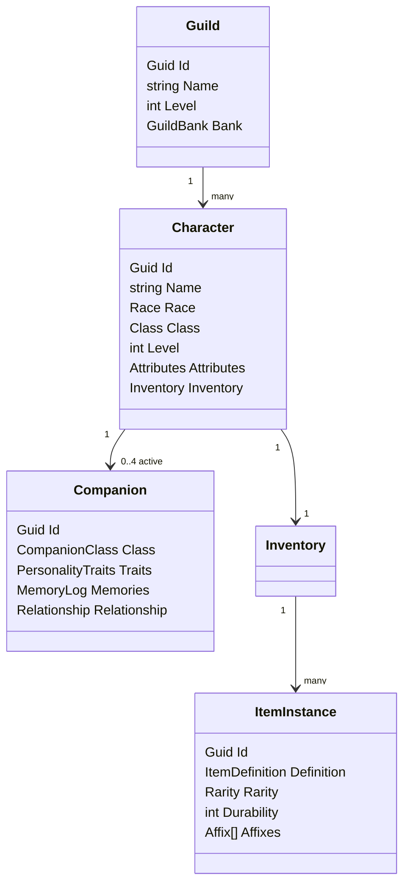
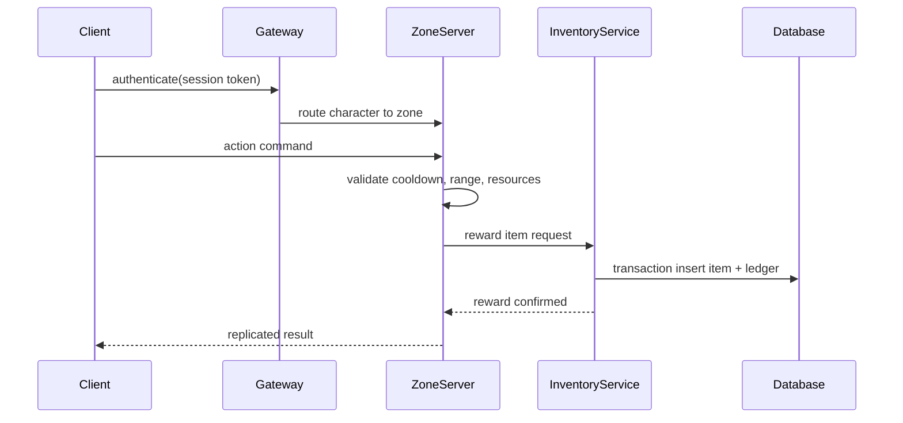

# UML Diagrams

### Core Domain

```mermaid
classDiagram
    class Character {
        Guid Id
        string Name
        Race Race
        Class Class
        int Level
        Attributes Attributes
        Inventory Inventory
    }
    class Companion {
        Guid Id
        CompanionClass Class
        PersonalityTraits Traits
        MemoryLog Memories
        Relationship Relationship
    }
    class ItemInstance {
        Guid Id
        ItemDefinition Definition
        Rarity Rarity
        int Durability
        Affix[] Affixes
    }
    class Guild {
        Guid Id
        string Name
        int Level
        GuildBank Bank
    }
    Character "1" --> "0..4 active" Companion
    Character "1" --> "1" Inventory
    Inventory "1" --> "many" ItemInstance
    Guild "1" --> "many" Character
```

### Server Flow

```mermaid
sequenceDiagram
    participant Client
    participant Gateway
    participant ZoneServer
    participant InventoryService
    participant Database
    Client->>Gateway: authenticate(session token)
    Gateway->>ZoneServer: route character to zone
    Client->>ZoneServer: action command
    ZoneServer->>ZoneServer: validate cooldown, range, resources
    ZoneServer->>InventoryService: reward item request
    InventoryService->>Database: transaction insert item + ledger
    InventoryService-->>ZoneServer: reward confirmed
    ZoneServer-->>Client: replicated result
```
